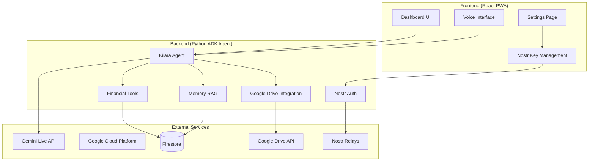

# Kiiara Architecture Diagram

## System Overview



## Data Flow

### 1. Voice Interaction Flow
```
User Voice → Microphone → WebSocket → ADK Agent → Gemini Live API → Response → Speaker
```

### 2. Nostr Authentication Flow
```
1. Frontend generates Nostr key pair (npub/nsec)
2. User signs challenge with private key
3. Backend verifies signature with public key
4. JWT token issued for API access
```

### 3. Google Drive Backup Flow
```
1. Financial data encrypted with Nostr private key
2. Encrypted JSON uploaded to Google Drive
3. Backup metadata stored in Firestore
4. Restoration: download → decrypt → load
```

### 4. Financial Tool Execution Flow
```
User request → Agent interprets intent → Selects appropriate tool → Tool executes → 
Result processed by Agent → Gemini generates response → Voice/Text output
```

## Components Detail

### Frontend (React + TypeScript)
- **Dashboard**: Financial overview with charts and recent transactions
- **Voice Interface**: Embedded ADK web UI for real-time voice interaction
- **Settings**: Nostr key management, Google Drive backup, integrations
- **PWA**: Service worker for offline support, installable in Chrome

### Backend (Python + ADK)
- **Kiiara Agent**: Gemini Live model with grandmother personality
- **Financial Tools**: Add transactions, budget summary, bills, goals, etc.
- **Nostr Authentication**: Verify Nostr signatures, issue JWT
- **Google Drive Integration**: Encrypt/decrypt and backup financial data
- **RAG Memory**: Persistent memory using Vertex AI RAG Engine

### External Services
- **Gemini Live API**: Real-time voice and vision processing
- **Google Cloud Run**: Hosting backend agent
- **Firestore**: Database for financial data and user profiles
- **Google Drive API**: Cloud storage for encrypted backups
- **Nostr Relays**: Decentralized identity verification

## Security

1. **Nostr-based Encryption**: Financial data encrypted with user's Nostr private key
2. **JWT Authentication**: Secure API access with token-based auth
3. **Google Cloud Security**: IAM roles, VPC, and encryption at rest
4. **Client-side Encryption**: Keys never leave user's browser

## Scalability

- **Stateless Backend**: ADK agent can scale horizontally on Cloud Run
- **Firestore**: Auto-scaling NoSQL database
- **CDN**: Static frontend assets served via Google Cloud CDN
- **Relay Pool**: Multiple Nostr relays for redundancy